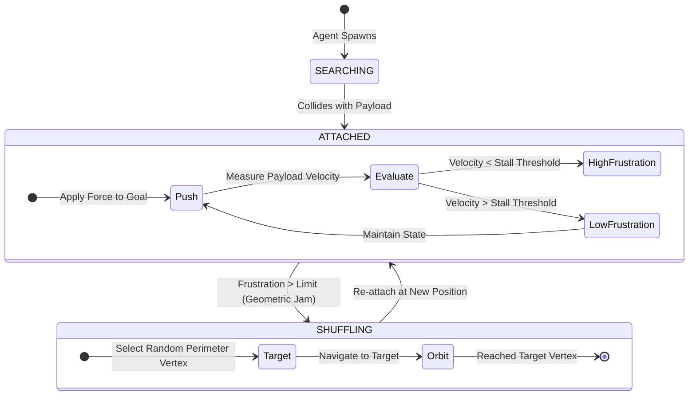

# Swarm-Based Geometric Transport
> **Bachelor's Thesis Project** | Vrije Universiteit Amsterdam
> *Decentralized Resolution of Geometric Jams via Frustration-Driven Shuffling*

## Abstract
Autonomous transport of irregular, non-convex payloads remains a bottleneck in swarm robotics. This repository contains a 2D physics simulation environment (powered by `pymunk` and `pygame-ce`) designed to test **Force-Mediated Stigmergy**. It demonstrates that a decentralized, frustration-driven shuffling heuristic allows a swarm to solve geometric jams (The Piano Mover's Problem) without centralized planning or global maps.

## Key Scientific Findings
1. **The Phase Transition:** The swarm exhibits a clear phase transition based on density ($N$). At low densities ($N=10$ to $15$), the swarm relies on intelligent **Stochastic Shuffling** to pivot the payload. At critical mass ($N \ge 20$), the behavior shifts to **Brute Force Extrusion**, overpowering geometric friction entirely.
2. **The "Torque Debt":** Comparative trials ($N=15$) between a simple Square and an irregular L-Shape revealed that non-convex geometries incur a "Torque Debt," requiring a statistically significant increase in collective shuffling to successfully navigate the constraint.

## Repository Structure
* `config.json` - Centralized parameters for physics, environment, and UI.
* `main.py` - The core Pygame visualization and simulation loop.
* `agents.py` - The decentralized state-machine and Frustration ($\Psi$) metric logic.
* `environment.py` / `geometry_utils.py` - Physics boundaries and composite shape generation.
* `experiment_runner.py` - Headless, parallelized batch execution for data collection.
* `thesis_analysis.ipynb` - Jupyter Notebook containing data synthesis, T-Tests, and plots.

---

## 🚀 How to Run the Simulation

### 1. Install Dependencies
Ensure you are using Python 3.10+ and install the required packages:
```bash
pip install -r requirements.txt
```

### 2. The "Hero" Visualization (GUI Mode)
Watch the swarm dynamically detect a jam and generate emergent torque to pivot the L-Shape.
```bash
python main.py --trials 1 --agents 15 --shape l_shape
```

### 3. Run the Data Pipeline (Headless Parallel Batch)
To generate your own telemetry dataset, use the experiment runner. This will utilize all available CPU cores.
```bash
# Run a specific test batch
python experiment_runner.py --shape square --trials 30 --agents 15

# Run the full Density Sweep (N=10, 15, 20, 25)
python experiment_runner.py
```

### 4. View the Data Analysis
Launch Jupyter to view the interactive plots and statistical T-tests.
```bash
jupyter notebook thesis_analysis.ipynb
```
## Swarm Architecture


---
*Developed as a Bachelor's Thesis concluding the Physics & AI codebase development.*
